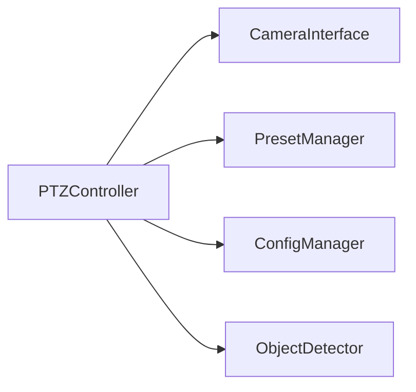

# PTZ AI Control System Architecture

## Components

1. Main Controller
2. PTZ Controller
3. Object Detector
4. Configuration Manager
5. Preset Manager

## Component Relationships

## PTZ Controller Component

### Responsibilities

- Manages pan/tilt/zoom movements
- Handles camera connection via ONVIF protocol
- Implements smooth movement transitions
- Maintains preset positions
- Provides automatic tracking capabilities

### Interfaces

- **CameraInterface**: ONVIF protocol implementation
  - Methods: continuous_move, stop, absolute_move
- **PresetManager**: Preset storage/recall
  - Methods: save_preset, recall_preset
- **ConfigManager**: Runtime configuration
  - Accesses: PTZ_MOVEMENT_GAIN, ZOOM_PARAMS
- **ObjectDetector**: Tracking coordination
  - Receives: bounding box coordinates

## Persistence

### Log File Handling

- Logs persisted to rotating files
- Configurable retention policy
- Optional file output control via write_log_file
- Log reset on startup via reset_log_on_start flag

## Interfaces

- ONVIF for camera control
- HTTP API for external integration

## PTZ Control Parameters

The PTZ control logic is parameterized via [`config.py`](../config.py:3), which centralizes all runtime-tunable values for pan, tilt, and zoom. Key parameters include:

- `PTZ_MOVEMENT_GAIN`: Gain for both pan and tilt movement.
- `PTZ_MOVEMENT_THRESHOLD`: Minimum error to trigger pan/tilt.
- `ZOOM_TARGET_COVERAGE`: Target object coverage for zoom.
- `ZOOM_RESET_TIMEOUT`: Timeout for zoom reset if no detection.
- `ZOOM_MIN_INTERVAL`: Minimum interval between zoom commands.
- `ZOOM_VELOCITY_GAIN`: Proportional gain for continuous zoom.
- `ZOOM_RESET_VELOCITY`: Velocity for zoom reset to home.
- `NO_DETECTION_HOME_TIMEOUT`: Timeout for returning to home position.
- `CAMERA_CREDENTIALS`: Dictionary containing camera IP, user, and password.

All PTZ logic and camera authentication depend on these configuration values for runtime flexibility and maintainability.
